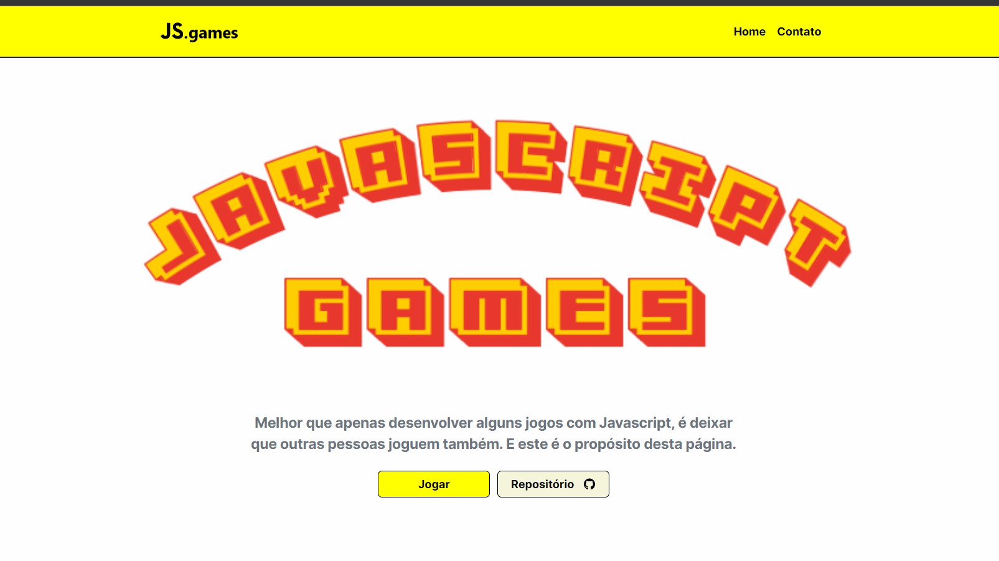

<h1 align="center">MiniJogos Javascript</h1>

Melhor que apenas desenvolver alguns jogos com Javascript, é deixar que outras pessoas joguem também. E este é o propósito desta página. 

  <a href="#-tecnologias">Tecnologias</a>&nbsp;&nbsp;&nbsp;|&nbsp;&nbsp;&nbsp;
  <a href="#-projeto">Projeto</a>&nbsp;&nbsp;&nbsp;|&nbsp;&nbsp;&nbsp;
  <a href="#memo-licença">Licença</a>

  

  

## 🚀 Tecnologias

Esse projeto foi desenvolvido com as seguintes tecnologias:

- HTML e CSS
- Bootstrap 5
- JavaScript

## 💻 Projeto

O website Meu Primeiro Milhão é um programa para o usuário simular em quanto tempo ele chegará em 1 milhão de reais. 

- [Visite o projeto online](https://bohr.io/danilloboing/jogosJavascript/preview/branch/main)

## :memo: Licença

Esse projeto está sob a licença MIT.

---

Made by Danillo Boing :wave: [Fale comigo pelo Linkedin!](https://www.linkedin.com/in/danilloboing/)

